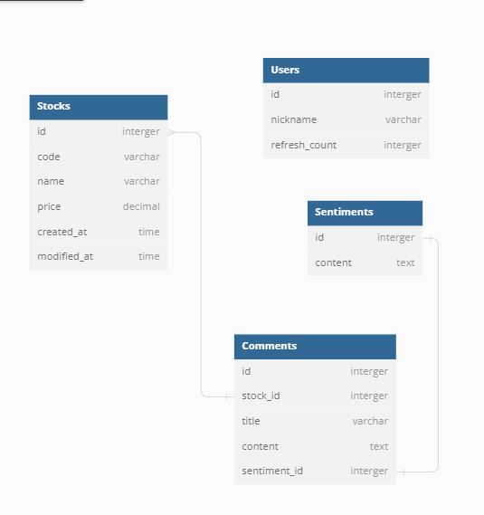

# twosim(투심)

주식(stocks) 종토방 긁어서 넣고(comments) AI의 센티멘트 분석(sentiments)

* 일정
  * 화 : 컨셉
  * 수 : ERD, 
  * 목 : Model, Swagger, 구현

* DBML

```
Table Stocks {
  id interger
  code varchar
  name varchar
  price decimal
  created_at time
  modified_at time
}

Table Users {
  id interger
  nickname varchar
  refresh_count interger
}

Table Comments {
  id interger
  stock_id interger
  title varchar
  content text
  sentiment_id interger
}

Table Sentiments {
  id interger
  content text
}

Ref: Stocks.id > Comments.stock_id
Ref: Comments.sentiment_id - Sentiments.id
```

* ERD
  
